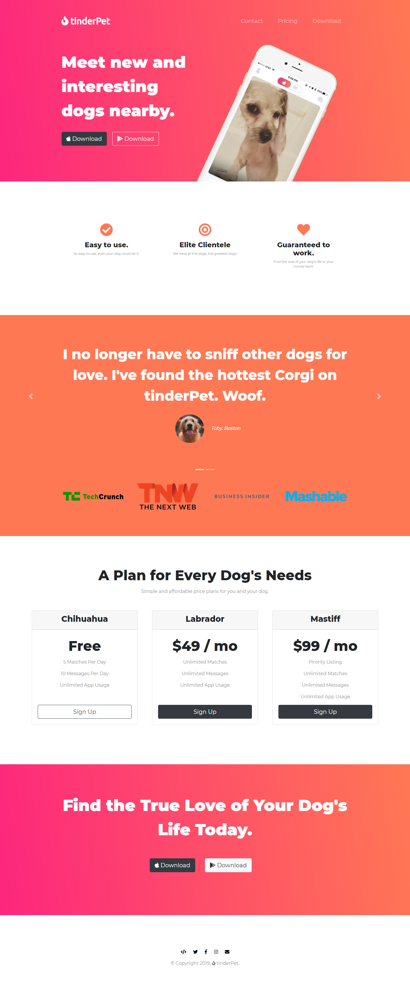

# tinderPet

tinderPet is a fictional web app that finds a suited partner for your dog. You and your will not be lonely again because tinderPet can make every single moment count for your dog by finding him/her the love of their life.

## Built with:

- HTML5
- CSS3
- Bootstrap 4
- JavaScript/jQuery

Visit the [live preview](https://tinderpet.netlify.com/).

## Future Improvements:

- [x] Allign the buttons inside the pricing box and have the box the same height. 
- [x] Add a javaScript scroll event for the links.
- [ ] Improve the ui design.
- [ ] Add some animations.

## How to Contribute?

Choose what you prefer:

- Open an issue [here](https://github.com/genesisgabiola/tinderpet/issues).
- Contact me on [twitter](http://twitter.com/genesisgabiola).

Any queries, suggestions, issues to report or critics are welcome :) You can freely connect to me.